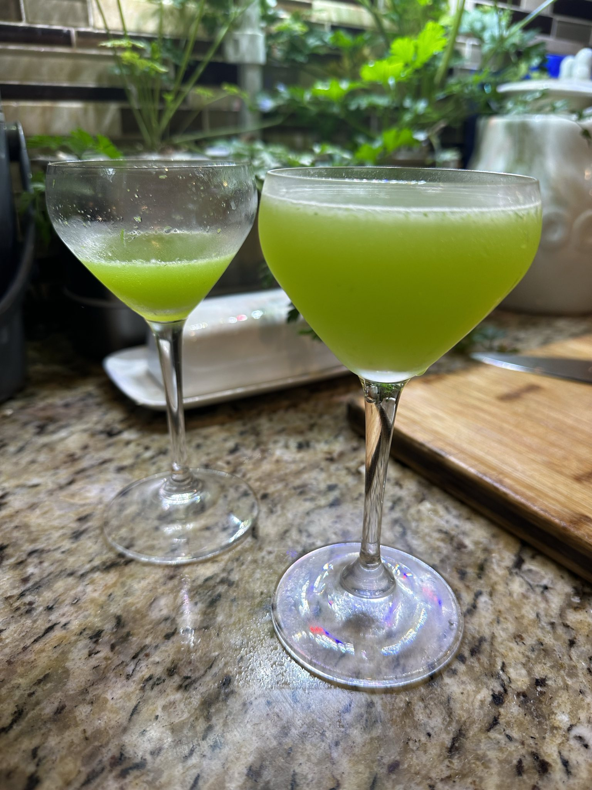

### Tom Collins
Sparkling lemonade with gin in it

Into ice-filled shaker, put:

- 1.5 oz Gin (Bombay Sapphire preferred)
- Juice of 1/2 lemon (approx 3/4 oz)
- The same amount of sugar syrup as juice

Shake vigorously until the shaker is very cold. Strain into ice-filled collins or highball glass. Top up with club soda and garnish with a lemon wheel.

tips: pour club into glass as you strain the drink for easy mixing

___
### French 75
A Tom Collins but with champagne instead of club soda. Be careful. This one is a creeper.

Into ice-filled shaker, put:

- 1.5 oz Gin (Bombay Sapphire preferred)
- Juice of 1/2 lemon (approx 3/4 oz)
- The same amount of sugar syrup as juice

Shake vigorously until the shaker is very cold. Strain into an empty champagne flute. Top up with champagne and garnish with a long lemon twist.

tips: long lemons twists are best done with a canelle knife

___
### Martini
The fastest way to get your pre-dinner buzz. For only the most experienced lushes and 

Pre-chill your martini glass by filling it with ice water while you do the other steps. For the drink, into ice-filled shaker or mixing glass, put:

- 4.5 oz Gin (Bombay Sapphire preferred)

and stir to chill. Don't shake or otherwise smash up the ice. When done, leave that and go back to your glass. Pour the water out and add just enough white vermouth to coat the inside of the glass. 

Prep your garnish of either lanced olives or a twist of lemon. Set aside.

Strain the gin into the glass. Add garnish. Drink while very cold

tips: Martinis should be crystal clear. Don't accidentally cloud or dilute your drink by shaking or breaking up ice. Martini glasses can easily slosh. If you're a sloppy drinker, consider buying Nick and Nora glasses. Gin people are usually particular about their gin. Don't subsititute without telling them.

___
### Eastside
A newer drink. It's a gin sour with mint and cucumber.

To an empty shaker, add:

- 3-4 cucumber slices
- 8-10 mint leaves
- 2 oz gin
- 3/4 oz simple syrup
- 3/4 oz lime juice

Muddle the cucumber and mint together to release the greens' flavor into the liquids. Top shaker with ice and shake until very cold. Double-strain into cocktail glasses

---

### Gin Rocket
Like an Eastside, it's a riff off the gin sour including greens

To an empty shaker, add:
- 1/4 cup arugula or rocket
- 1/4 cup mixed chopped fennel bulb and fronds
- 2 oz gin
- 3/4 oz lime juice
- 3/4 oz sugar syrup

Mix everything together in a cocktail shaker and muddle well. Shake well over ice then double-strain into a cocktail glass

___
### Whiskey Sour
A classic drink served with an optional egg white. That can be omitted, but you won't get the same silky mouthfeel associated with high-end whiskey sours

Into ice-filled shaker, put:

- 1.5 oz Whiskey (bourbon>rye>other but stay away from most scotches)
- Lemon Juice (approx 1 oz)
- The same amount of sugar syrup as juice

Shake vigorously until the shaker is very cold. Add one egg white and shake again. Strain into an ice-filled tumbler and garnish with a marachino cherry

tips: Separate egg white from its yolk into the top of the strainer instead of the bottom with the rest of the ingredients in case you break the yolk. For egg white drinks, a large block of ice gives a creamier mouthfeel than ice cubes. 

___
### Old Fashion
One of the oldest cocktails. A rite-of-passage for every drinker

Into empty short glass (tumbler, old-fashioned glass, etc), put:

- A spoonful of sugar-in-the-raw/demarara sugar or a sugar cube
- Enough Angostura bitters to saturate (4 dashes)
- 4 dashes orange bitters
- 1 oz water

Use a muddler to smash up sugar crystals and encourage dilution. Muddle for 30 seconds. The sugar never completely dissolves. Top glass with ice then add:

- 2.0 oz of whiskey (rye>bourbon>others)

Garnish with an orange peel and marachino cherry, and serve as-is. The drinker is expected to mix their own drink and dissolve the sugar to the own personal taste.

tips: Ask the drinker what whiskey they like. Some people really care. This drink is meant to evolve - meaning the beginnings and end of the drink are meant to be different. Melting ice is going to dilute the alcohol and dissolve the sugar and make it milder over time. If you don't have orange bitters, you can zest some orange peel in with the sugar and muddle that in.

___

### Manhattan
A classic whiskey cockatil. It's basically a old-fashioned-martini hybrid.

Into an ince-filled shaker, put:

- 2 oz. Whiskey (rye or bourbon)
- 1 oz. Red Vermouth
- 4-6 dashes Angostura Bitters

Shake until very cold then strain into cocktail glass. Garnish with a marachino cherry

tips: The cherry doesn't go onto a pick, so don't choke

___

### Margarita

Into an ice-filled shaker, put:

- 1.5 oz Tequila (anejo>reposado>blanco)
- 3/4 oz Triple Sec
- 3/4 oz Lime Juice
- Dash of simple syrup

Shake until very cold. Strain into ice-filled tumbler or maragita glass. Garnish with a lime wheel. 

___